# Proyecto reto I: Desarrollar un manejador de proyectos

## Getting Started

The content of this repository is the initial section of the implementation of a project manager software based on the scrum methodology containing the following:

* Class diagram that covers all requested requirements

* All the necessary routes for the project to work based on the REST model and the class diagram

* Interaction diagram that explains the flow according to the requirements.

* Docker image 

### Prerequisites

    *node js 
    *npm 
    *docker

### Installing

1.Clone this repository:

    git clone git@gitlab.com:a348503/agilez.git

2.Install the dependencies by running the following command:

    npm install

3.Start the server 

    npm start

4.In a browser enter the following url address:

    http://localhost:3000

### To run it from a docker image

1.Download the docker image:

    docker pull iamzaidgm/agilez

2.Run the container:

    docker run -p 80:80 agilez

## Built With

* node js
* npm
* express

## Diagrams 

Classes Diagram
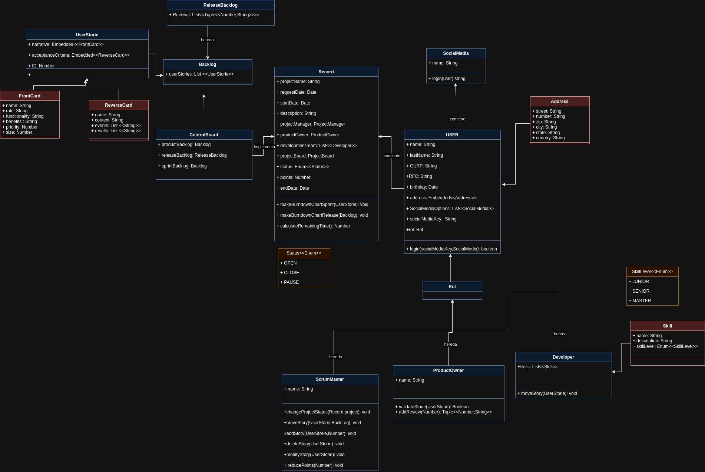

* Link:
https://drive.google.com/file/d/1RcyUPcFcGBGd8ZW8pzSbsu7FcxpWls4N/view?usp=sharing 

Main Interaction Diagram

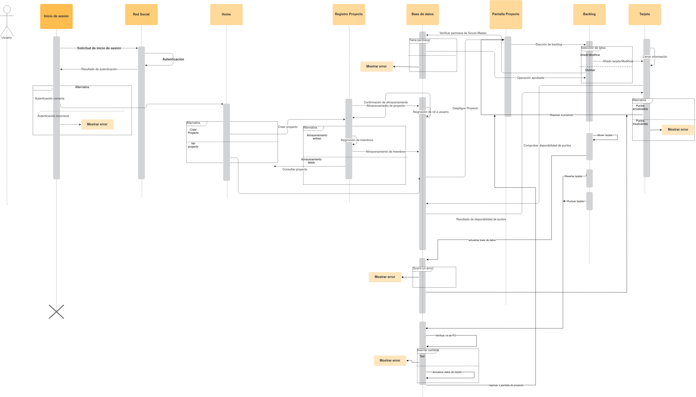

*Link https://drive.google.com/file/d/1R7WHn3MdDr8EC1nR5Q1ozLFIYh7H3a1H/view?usp=sharing

Interaction Diagrams

* Create Project
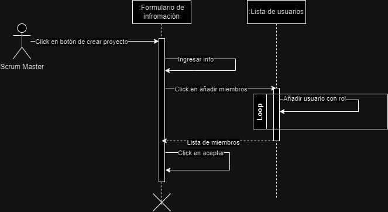

The creation of a project is managed by the user with the Scrum Master Rol, this user should
fill a form with the information abput the project and asign members to the project and their rol.

* Assigning members to a project
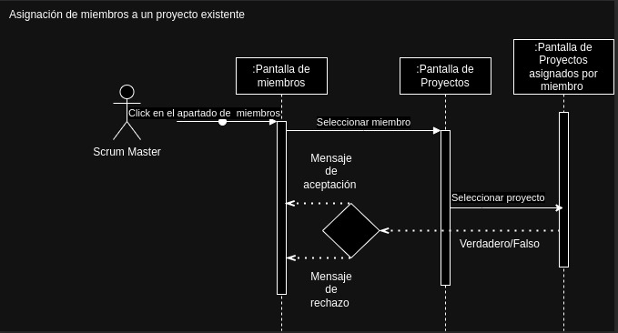

The Scrum Master is able to add developers or product owners at any time into the project.

* Register

Any user should login with one social media account (they could use at least 3 social media accounts to login),
then they should complete some information.

* Add Skills
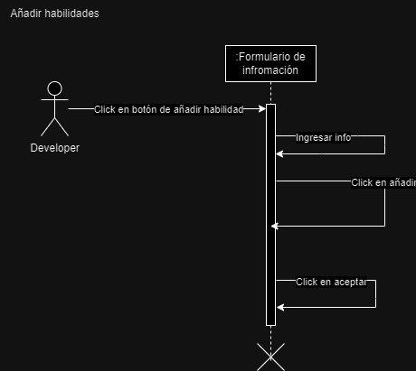

Any developer can add their skills, anyway the Scrum Master is able to change the habilities if it's necessary.

* Edit Skills
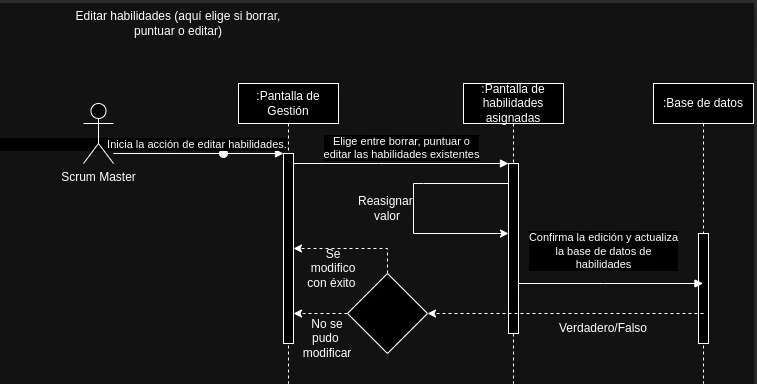

The Scrum Master can change the habilities of a team member if this habilities don't fit with the reality,
trough a list of members of the project, the Scrum Master is able to click on an option to edit the of
related to a team member.

* Log in
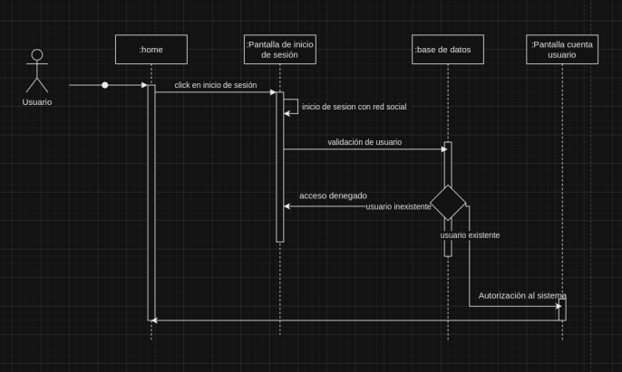

The login is with one of the social media accounts, all the users can log to a social media account and then
the system validate if that account is referenced by some of the system accounts and let the user login.

* Add Cards

The Scrum Master is able to create narratives in any backlog, every time a card is inserted the system verify that
the amount of points given to that card is equal or less to the remaining points and then let or not add the cart.

* Delete Cards
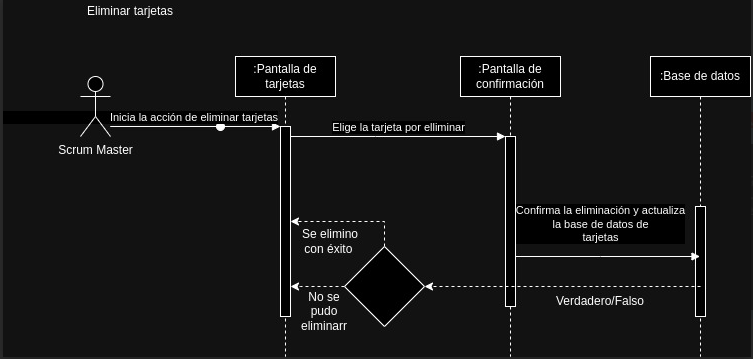

The Scrum Master is able to delete a card, recibing a feedback message from the system.

* Modify Cards
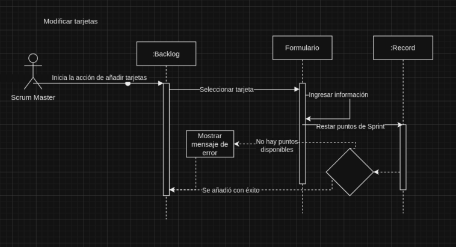

The Scrum Master can modify the content of any card at any backlog, if the points changed, this points needs to
be validate with the scrum remaining points.

* Move Cards 
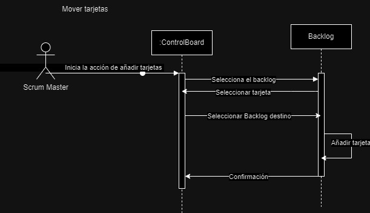

The developers and the Scrum master can change the cards between the backlogs.

* View graphs
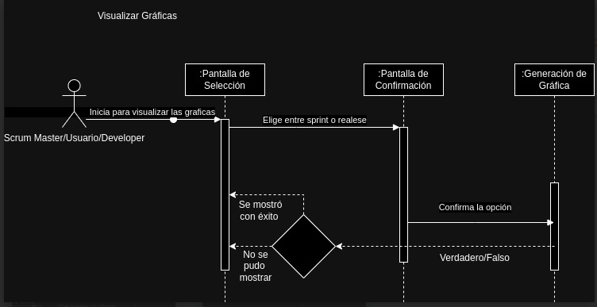

All the users can see a diagram of the selected sprint or about the release.

* Validate cards
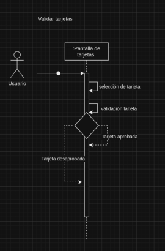

The product owner can validate the narratives in order to provide feedback to the dev team, the product owner will vote
if the narrative is ok or not.

* Add review to release
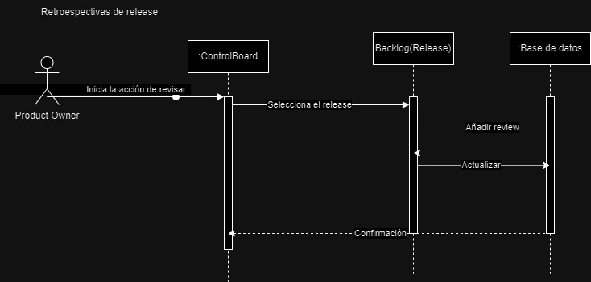

The product owner can add a review to a backlog release in order to provide feedback to the dev team.

* Change project status
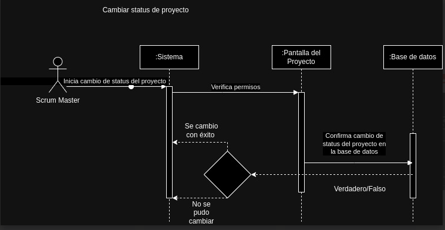

The Scrum master can change the status of a project (open, close or stopped).

## Authors

Anahí Peinado Villalobos 353262

Gilberto Contreras Conn 348503

Zaid Joel Gonzalez Mendoza 353254

## License

Does not have a license

## Acknowledgments
* I.S Luis Antonio Ramírez Martínez 
 