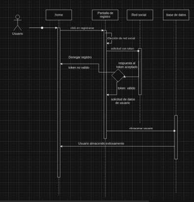

# Proyecto reto I: Desarrollar un manejador de proyectos

## Getting Started

The content of this repository is the initial section of the implementation of a project manager software based on the scrum methodology containing the following:

* Class diagram that covers all requested requirements

* All the necessary routes for the project to work based on the REST model and the class diagram

* Interaction diagram that explains the flow according to the requirements.

* Docker image 

### Prerequisites

    *node js 
    *npm 
    *docker

### Installing

1.Clone this repository:

    git clone git@gitlab.com:a348503/agilez.git

2.Install the dependencies by running the following command:

    npm install

3.Start the server 

    npm start

4.In a browser enter the following url address:

    http://localhost:3000

### To run it from a docker image

1.Download the docker image:

    docker pull iamzaidgm/agilez

2.Run the container:

    docker run -p 80:80 agilez

## Built With

* node js
* npm
* express

## Diagrams 

Classes Diagram

* Link:
https://drive.google.com/file/d/1RcyUPcFcGBGd8ZW8pzSbsu7FcxpWls4N/view?usp=sharing 

Interaction Diagrams

* Create Project

* Assigning members to a project

* Registrer

* Add Skills

* Edit Skills

* Log in

* Add Cards

* Delete Cards

* Modify Cards

* Move Cards 

* View graphs

* Validate cards

* Add review to release

* Change project status

## Authors

Anahí Peinado Villalobos 353262

Gilberto Contreras Conn 348503

Zaid Joel Gonzalez Mendoza 353254

## License

Does not have a license

## Acknowledgments
* I.S Luis Antonio Ramírez Martínez 
